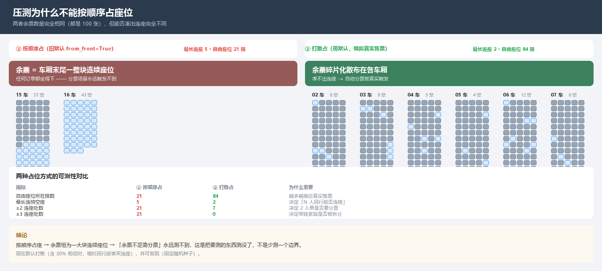

# SmartRail-Seat-Engine：高铁选座决策引擎（V1.0 启发式 → V2.0 运筹学 → V3.0 强化学习）

## 项目简介

**SmartRail-Seat-Engine** 是一个从零实现的**铁路客运选座决策引擎**，用**分层罚函数 + 状态机**把"选座"这件看起来简单的事情，拆解成一套可解释、可测试、可降级的工程系统。

选座的本质是一个**带硬约束的组合优化问题**：座位是有限的二维资源，乘客之间又存在强弱不一的同行关系（带娃家庭、轮椅旅客与陪护、孕妇与同伴、静音车厢偏好……）。真正的难点不在"找到一个空位"，而在于：

- **底线不能破**：带娃家庭被拆散、轮椅旅客被分到非无障碍座位这类事故，任何情况下都不允许发生；
- **优先级要分明**：同样是"不理想"，把儿童和父母分开与"成人没坐到靠窗"，严重程度差了三个数量级；
- **结果要能解释**：调度员和旅客都需要知道"为什么这么排"；
- **高负载要能活**：春运峰值下必须自动降级，宁可给次优解也不能超时或崩溃。

项目分三代演进，**三代共用同一套代价函数与评估口径**，因此可以直接并排对比：

| 版本 | 技术路线 | 求解方式 | 定位 |
| :--- | :--- | :--- | :--- |
| **V1.0** | 规则 + 分层罚函数 | 优先级单元 + 分支限界（零第三方依赖） | ✅ **生产主线（最终交付）** |
| **V2.0** | 运筹学（OR-Tools CP-SAT） | 布尔约束建模 + 目标函数线性化 | ✅ 精确求解路线（**已实跑，实测 OPTIMAL**） |
| **V3.0** | 强化学习（GNN + PPO + 行为克隆） | 二分图编码 + 序列决策 | 🔬 探索路线（**代码保留，未替代 V1+V2**） |

> **一句话结论**：V1 是生产主线，V2 是精确求解的补强，**V3 是探索且未被采用**。
> V3 的训练努力与三条负面结论都完整写进本文件（见"V3.0 训练复盘"与
> `docs/DEVELOPMENT_LOG.md`），代码一行未删 —— 它们比"又一个效果一般的模型"更有长期价值。

## 核心成绩

### V1.0 —— 底线守卫与可解释性

- **Tier 0 违规 0 条**：在 300 单 / 788 位乘客的仿真中，跨车厢拆散硬绑定、轮椅无无障碍座位、孕妇无同伴三类事故**均为 0**。这不是"调参调出来的"，而是候选池结构性排除 + 巨额罚分 + 断言守护三层保障。
- **带娃家庭不被拆分**：`family_with_child` 场景稳定输出 `01车[A1@01A A2@01C C1@01B]` —— 儿童被夹在双亲之间（相邻三座），代价 -130（负值代表奖励，约束满足良好）。
- **可解释性**：每一次分配都能输出"逐条代价明细"，例如 `T5_CHILD_ADJACENT +50（儿童紧邻家长）`、`T4_NOT_SAME_ROW −30（未同排）`，而不是只给一个分数。
- **降级容灾**：峰值场景（85% 预占座）下模式分布自动变为 `smart 46 / degraded 11`，降级时仍保持 **Tier 0 = 0**。

| 场景 | 订单数 | 就座乘客 | 模式分布 | Tier 0 | P50 | P95 | P99 |
| :--- | ---: | ---: | :--- | ---: | ---: | ---: | ---: |
| 平峰（空车起售） | 300 | 788 | free 230 / smart 70 | **0** | 3.02 ms | 9.83 ms | 23.73 ms |
| 峰值（85% 预占） | 47 | 119 | smart 39 / degraded 8 | **0** | 1.03 ms | 4.76 ms | 6.97 ms |

> **未达标项（如实说明）**：设计目标是 **P99 < 15 ms**，实测平峰 P99 = 23.73 ms，**仍未达标**（峰值场景 6.97 ms 已达标）。原因是团体长尾订单（6 人以上）触发分支限界搜索，单笔耗时可达 24 ms。缓解手段是自适应预算 + 降级贪心（已生效，故 Tier 0 仍为 0），根治手段是 V2.0 的 CP-SAT 与批量求解。
>
> 这组数字是在**修正编组容量之后**重测的（见坑点 11）：旧编组把商务座夸大成 51 座、总容量 1156 座，容量虚高会让压力测试偏乐观。

### V2.0 —— 运筹学建模

- **CP-SAT 完整建模**：Tier 0/1 写成布尔硬约束，软约束写成目标函数线性化项，详见下文"CP-SAT 建模要点"。
- **零依赖后端可用**：`v2_exact` 在没有任何第三方库的环境下与 V1 给出**逐座位完全一致**的分配。
- **算法件独立验证**：自研匈牙利算法通过 **40+ 组随机矩阵**（含 big-M 稀疏、矩形、负值）与暴力枚举交叉验证，全部一致。
- **诚实边界**：CP-SAT 的全部实测数据都来自 **OR-Tools 9.15.6755** 装好之后的真实运行；
  在装好之前，仓库与验收页都把它显式标记为不可用，并以 `BackendUnavailable` 报错
  而非静默换引擎 —— 这段历史保留在 `docs/DEVELOPMENT_LOG.md`（踩坑记录 5）。

### V2.0 —— 运筹学路线：**已实跑**，并修掉三个只有运行才能发现的缺陷

V2.0 有两个后端，状态**完全不同**，必须分开说：

| 后端 | 实现 | 可运行？ | 实测结果 |
| :--- | :--- | :--- | :--- |
| `v2_cpsat` | OR-Tools CP-SAT，布尔约束建模 | ✅ 需要 `ortools` | **OPTIMAL，亲和度 180 = V1** |
| `v2_exact` | 零依赖，**委托 V1 分支限界** | ✅ | 与 V1 **逐项完全相同** |

#### 第一次真跑就暴露的三个缺陷

**① 指示量不是布尔变量 —— `AddBoolOr` 直接抛异常**

```
AttributeError: 'ortools.sat.python.cp_model_helper.SumArray' object has no attribute 'Not'
```

`carriage_indicator` / `column_indicator` 返回 `sum(variables)`：0/1 个元素时是
**Python int**、多个元素时是 **SumArray**，两者都没有 `.Not()`。更根本的是
CP-SAT 的 `AddBoolOr` 要求**字面量**（布尔变量或其取反），而 `sum` 是线性表达式。
**修正**：显式建布尔指示量并约束 `ind ≤ Σvars ≤ n·ind`。

**② `left == right` 允许"两人被拆到不同车厢"**

```python
model.Add(carriage_indicator(a, c) == carriage_indicator(b, c))   # 错
```

看似在说"两人同车厢"，实际允许错误分配：若 a 选车厢 2、b 选车厢 3，
则 c=2 时 (1,0)、c=3 时 (0,1) —— **两个等式都满足**，但两人被拆开。
实测：家长在 03 车、儿童在 02 车，**Tier 0 = 1**，而 CP-SAT 报 OPTIMAL。
**修正**：改成双向蕴含 `AddImplication(left, right)` + `AddImplication(right, left)`。

**③ 根因：候选池让硬约束无解可施**

修完上面两条仍然拆开。真正原因是候选池：

| | 候选车厢分布 |
| :--- | :--- |
| A1（家长） | `{1: 13, 2: 1, 3: 13, 11: 13}` ← **车厢 4 消失** |
| C1（儿童） | `{1: 13, 2: 13, 4: 13, 5: 1}` |

`per_carriage = per_passenger // 3 = 13`，按车厢亲和度依次填满 13+13+13 = 39，
预算用完，**第 4 节及以后的车厢一个候选都拿不到**。两人可能同处的车厢 4
在 A1 侧没有候选，"同车厢"约束自然无处施加。

**修正**：候选池改为**均衡轮转**（每节车厢先各取最好的 1 个，循环到预算用尽），
并对高亲和度车厢"加厚"几轮；同时对硬绑定双方求**共同可坐车厢**交集。

> **这是本项目第五次吃到同一个教训**：罚分只能影响"选哪个"，
> 候选池才决定"能不能选"。CP-SAT 没有错，是候选池让它无解可施。

#### 实测对比（同一张 3 人单：2 成人 + 1 儿童，亲子硬绑定）

| | 耗时 | 亲和度 | 就座 | Tier 0 | 结果 |
| :--- | ---: | ---: | ---: | ---: | :--- |
| V1 分支限界 | **7 ms** | 180 | 3/3 | 0 | 02车01A/B/C（同排连座） |
| V2 CP-SAT | 366 ms | 180 | 3/3 | 0 | 15车01A/B/C（同排连座） |

**两者亲和度相同（都是最优）**，CP-SAT 慢约 50 倍（运筹学求解器的固有代价）。
选的车厢不同**不是缺陷**：个体分只区分静音车厢（+50）与带娃进静音车厢（−1250），
其余车厢**完全同分**，因此 02 车与 15 车是**真正的并列最优**。

**关于 `v2_exact`（不是独立的第二条路线）**

它复用 V1 的分支限界，只在 `notes` 里标注来源。所以对比表里
V2 与 V1 的每一个数字都相同 —— 这不是"两条路线殊途同归"，
而是**它们本来就是同一段代码**。

> **为什么不做成独立实现**：自研的"精确求解"写过两版，都因为**代理目标
> 与权威代价漂移**而给出错误答案（实测 −3470 / −2890 / 105，真值 130 / 60 / 130）。
> 与其维护一份会算错的精确求解器，不如明确复用已验证实现。
> 详见 `docs/DEVELOPMENT_LOG.md` 第 5 条。匈牙利算法作为**独立可用件**保留
> （120 组随机矩阵与暴力枚举验证一致），但不接入选座主链路。

### V3.0 —— 仿真器 + 强化学习（**探索路线，未替代 V1+V2**）

> **最终交付结论**：V3.0 的代码完整保留在 `smartrail/v3/`，但**生产交付使用 V1+V2**。
> 下面是**同一订单流、同一 seed、同一初始占座比例**下的实测对照（`seed=7`，空车起售，
> 指标口径完全一致）—— 这组数字在三种订单流长度下重复测过，结论一致。

| 策略 | 订单流 | 就座率 | 候补 | 亲和度 | Tier 0 | 孤立照护 |
| :--- | ---: | ---: | ---: | ---: | ---: | ---: |
| **V1 启发式** | 30 / 60 / 120 步 | **1.000 / 1.000 / 1.000** | **0** | **3675 / 7660 / 15035** | 0 | **0** |
| V2 精确（=V1） | 30 / 60 / 120 步 | 1.000 / 1.000 / 1.000 | 0 | 3675 / 7660 / 15035 | 0 | 0 |
| V3 行为克隆 | 30 / 60 / 120 步 | 0.930 / 0.878 / 0.743 | 5 / 19 / 79 | −178890 / −250695 / −579975 | 0 | 27 / 42 / 68 |
| V3 PPO | 30 / 60 / 120 步 | 0.479 / 0.545 / 0.554 | 37 / 71 / 137 | −3890 / −156410 / −315680 | 0 | 0 / 2 / 8 |

**为什么最终不用 V3**（每一条都有上面的数字支撑）：

1. **质量没赢，而且差距很大**：行为克隆的就座率**从未追平 V1**（最好 93% vs 100%），
   亲和度低 **2 个数量级**（−17.9 万 vs +3675），孤立照护最多 68 例 vs V1 的 0 例；
2. **随订单流变长持续退化**：93% → 88% → 74%。这说明学到的策略**不具备 V1 那种
   "长期占座管理"能力** —— V1 每单都在全局视角下搜索，而策略只看当前订单的局部特征，
   早期"图省事"的落座会不断蚕食后续订单的可行性；
3. **速度慢 5 倍**：V3 单步要跑 GNN 前向（P50 12.2 ms），V1 分支限界只要 2.4 ms；
4. **依赖更重**：V3 需要 PyTorch + NumPy，而 V1 零第三方依赖；
5. **可审计性更差**：V1 的每条决策都能追到具体代价条目，学习型策略只能给出打分。

> **口径更正说明**：本文件早期版本写过"行为克隆把就座率提升到 100%"。
> 那是**训练期评估口径**（30 单、老师解在候选池内投影、且评估与训练同分布）的结果，
> 与上面这套**统一验收口径**不一致。按统一口径复测后，该结论不成立，已更正。
> 保留这条说明是为了避免"文档里的漂亮数字"再次误导后续判断。

**留下什么**：完整的行为克隆流水线（可复用于"从历史投诉学偏好权重"）、
二分图 GNN 编码器、自研 PPO、以及 3 条写进"踩坑记录"的负面结论
（见坑点 8/9/10）。这些比"又一个效果一般的模型"更有长期价值。

**展望**：V3 真正值得投入的方向**不是**"让网络直接输出选座动作"（这条已被上面的
数字否掉：局部决策打不过整单搜索），而是**从历史投诉与换座记录里学习偏好权重**，
替代当前人工标定的 Tier 权重 —— 那才是学习型方法相对运筹学的比较优势所在
（规则说不清、结果好评价）。

## 🧮 分层代价函数（Tier 0-5）

整套引擎的核心是这个**分层罚函数**。设计原则：**层级之间量级差至少一个数量级**，保证任何情况下高优先级的约束都不会被低层级的奖励淹没。

| 层级 | 权重 | 触发条件 | 语义 |
| :--- | ---: | :--- | :--- |
| **Tier 0** | −100,000 | 硬绑定被跨车厢拆散 / 轮椅旅客无无障碍座位 / 孕妇无同伴 | **绝对底线，不可违反** |
| **Tier 1** | −10,000 | 易受伤害旅客或照护单元被跨车厢拆开 / 硬冲突群体被孤立 | 严重事故 |
| | −3,500 | `T1_ISOLATED_CARE_MEMBER`：需照护者身边没有支持人 | 安全底线 |
| | −60 | `T1_CARE_BOND_SAME_CARRIAGE`：同车厢但未相邻 | 轻微不理想 |
| **Tier 2** | −3,000 | 成人同行人跨车厢 | 体验受损 |
| **Tier 3** | −2,500 × 排斥度 | 带娃家庭占用静音车厢 | 冲突 |
| | −800 / 人 | `T3_QUIET_GROUP_EXTRA`：团体超员占用静音车厢 | 资源误用 |
| | −5,000 | 被投诉屏蔽的旅客仍被排入静音车厢 | 信用机制 |
| **Tier 4** | −10 / −30 | 被过道分隔 / 未同排 | 舒适度 |
| **Tier 5** | +50 / +40 / +30 / +20 | 静音车厢独行成人 / 无障碍匹配 / 同伴同座 / 设施匹配 | 正向奖励（**每人封顶 60**） |

### 两个关键设计决策

**1. Tier 0 用"结构性排除"而不是"巨额罚分"。** 轮椅旅客的候选池在建模阶段就只保留无障碍座位，硬绑定双方只保留共同车厢的候选。这样 Tier 0 从"罚分很重"升级为"**不可行**"，语义更强，也不会因为其他项累加而被意外抵消。

**2. 奖励必须有硬上限。** 早期版本没有 `max_reward_per_passenger`，导致 Tier 3 的静音车厢奖励按人头累加，**反向利好**"家庭坐静音车厢"这个错误行为。现在每人奖励封顶 60 分，且设有 `min_floor_reward = 10.0` 的碎片化奖励地板。

## 🛡️ 底线承诺（由 157 条断言守护）

测试总量：**157 条断言全部通过**（`python tests/pytest_shim.py -q`）。

| 承诺 | 断言数 | 验证方式 |
| :--- | ---: | :--- |
| 带娃家庭不被拆分（硬绑定同车厢） | 30 | 底线套件：构造场景 + 检查 Tier 0 = 0 |
| 轮椅旅客必有无障碍座位 | ↑ | 同上 |
| 孕妇必有同伴 | ↑ | 同上 |
| 一人一座（无重复座位） | ↑ | 编组构造期 + 分配期双重校验 |
| 每个配置项都真被代码读取 | ↑ | 静态扫描 + 行为验证（见"配置卫生不变量"） |
| 编组座位数接近真实 CRH | ↑ | 各车厢排数不同、按坐席递减（见坑点 11） |
| V2/V3 插件层、CP-SAT 建模、仿真器 | 17 | 缺失依赖时**跳过而非失败** |
| **人员构成规格**（总人数/拒票规则/独立维度） | 11 | 见"人员构成与出票规则"章节 |
| **构成 → 订单映射**（总人数守恒、陪同靠绑定） | 7 | 展开后的乘客数必须等于基础分组之和 |
| **构成提交接口**（先校验、通过才求解、多单隔离） | 5 | 被拦下的订单不进入求解器 |
| 模块化乘客、自动组单、下单入口在 `/dev` | 7 | 含"没有被照护者孤身成单"校验 |
| 出票优先策略（无相邻座位仍出票） | 7 | 6 个场景 + 站车协助提示 |
| **各种多人组合订单** | 9 | 12 种人群组合 × 3 席别矩阵 + 硬绑定同车厢 |
| 业务核心与 HTTP 端到端 | 5 | 零依赖服务真实请求 |
| 前端 DOM / 接口 / 字段契约 | 4 | 真实起服务 + 抓取页面 + 校验字段 |
| FastAPI 真实端到端（ASGI 直驱） | 13 | 需 `fastapi` + `httpx` |

> 另有 `tools/verify_order_api.py` 做**接口级**验收（自带服务、打真实接口），
> `tools/check_page_js.py` 在 Node 里**真跑页面 JS 并逐个点按钮**，
> `tools/verify_served_pages.py` 检查**服务实际下发**的页面。

## 🚄 12306 风格购票流程（用户模式 / 开发者模式）

`/ticket` 与 `/dev` 两个页面严格对齐 12306 的真实交互，与"座位图工具页"
（`/`、`/ticket-first`、`/acceptance`）**并存但职责分开**：
后者是调试与压测工具，前者是面向旅客的购票流程。

> **`/booking` 批量提交页面已删除**：它的批量订单输入对使用者是负担。
> 下单能力集中到 `/dev`（**按基础分组加人数** → 选席别 → 提交）。
> 底层的"任意张数 × 每单任意人数与类型"**接口能力保留**，
> 由 `tools/verify_order_api.py` 守住。

### 用户模式（`/ticket`）

| 环节 | 实现 |
| :--- | :--- |
| 车次列表 | 北京南 → 上海虹桥，G25 / G35 / G531，各席别余票与"有票 / N张 / 无" |
| 预订 | 点"预订"进入确认订单页，可选二等座 / 一等座 / 商务座 |
| 选择乘车人 | **不预置任何乘车人**，首次进入引导添加 |
| 添加乘车人 | **两层人群选择**（见下） |
| 提交限制 | **必须先添加乘车人**才能提交 |
| 选座服务 | **只显示一排 A / B / C / D / F** 供选偏好 |
| 静音车厢 | 勾选项，标注 03 / 11 车 |
| 自动分票 | **仅当多人订单且余票无法满足选座要求时**才介入，并明示原因 |

#### 基础分组只有 5 类（这是需求给定的口径）

```
id: 'adult'   成人    满18周岁及以上
id: 'youth'   青少年   满14周岁但未满18周岁
id: 'child'   儿童    满4周岁但未满14周岁
id: 'toddler' 幼儿    满1周岁但未满4周岁
id: 'infant'  婴儿    未满1周岁
总人数 = adult + youth + child + toddler + infant
```

**特殊人群是在这 5 类之上叠加的独立维度，不计入总人数** ——
孕妇（按孕周）、残疾（程度 × 年龄段）、儿童细分（安静/吵闹）
都在 `composition.excluded_from_total` 里，只做标签与出票规则。

> **一处纠正（我先前做错了）**：早期 `passenger_store.PASSENGER_TYPES`
> 里另立了一套 16 类，**还自己加了"学生"当成基础分组**，并把
> "孕妇（4-6个月）""视障（需导盲）"平铺在同一层。需求方从未定义过
> "学生"这个分组 —— 学生是**票价属性**（`price_ratio` 0.75），不是人群分类。
>
> 现在每个类型都带 `base_group` 与 `special` 两个字段，
> `test_ticketing.py` 机器校验"基础分组恰好是那 5 类""学生不在基础分组里"
> "每个类型都归属到某个基础分组"。

| 层 | 分组 | 内容 |
| :--- | :--- | :--- |
| **基础分组**（决定总人数） | 基础分组 | **成人 / 青少年 / 儿童 / 幼儿 / 婴儿** |
| 叠加维度（不改变总人数） | 特殊人群 · 老年 | 老人 |
| | 特殊人群 · 孕妇 | 按孕周 4 档（1-3 / 4-6 / 7-9 / 10个月37周+） |
| | 特殊人群 · 残疾 | 轮椅 / 视障 / 视障需导盲 / 智力障碍 |
| | 儿童细分 | 安静 / 吵闹（参与静音车厢代价计算） |
| | 陪同人 | 照护人（与需照护者绑定同车厢） |
| | 票种（票价属性） | 学生票（按成人计价，仅影响票价） |

**用户端看不到整列车的座位分布图** —— 这是需求明确要求的。
`/ticket` 页面的 HTML 里**没有任何座位图容器**，
也不调用任何 `/api/dev/*` 接口（由 `tools/verify_ticketing.py` 断言守护）。

### 开发者模式（`/dev`）

| 功能 | 实现 |
| :--- | :--- |
| **提交订单** | **按基础分组加人数**（成人 / 青少年 / 儿童 / 幼儿 / 婴儿，各 0-99），需要时展开"特殊人群"叠加孕妇孕周与残疾程度 × 年龄段，然后选席别提交 |
| **下单记录** | 开发者组单与用户模式下单**都记进同一台账**，含基础分组、逐位乘客座位、排布、分档与未出票原因 |
| 预制数据 | 各类人群各一位，共 18 位默认购票人（**仅本页可见**，用户模式看不到） |
| 模拟余票 | 滑杆调整某席别余票，**实时影响用户模式** |
| 全局座位图 | 16 节编组完整座位图，区分"用户已售 / 手动锁定 / 预设占用" |
| 静音车厢标记 | 03 车与 11 车，座位图上有紫色描边 |
| 分票映射 | 用户下单的座位在座位图上按订单着色，并标注乘客姓名 |
| 重置系统 | 一键清空订单与占用，乘车人回到预制状态 |
| 快速压测 | 空车 / 三成 / 六成 / 八成五 / 满座（**打散占用**，并显示碎片化指标） |

> **为什么按下单页不是"勾选姓名"**：人名对下单没有意义，而且预制档案
> 只有固定几个人 —— 想验证"10 位成人"就必须能加 10 个成人。
> 所以开发者页的下单面板是**加减数量的步进器**，提交走
> `/api/composition/submit`（构成接口），与 `composition.py` 的口径完全一致。
>
> **订单会被保留**：这条路径原先完全没有记录 —— `/api/composition/submit`
> 直接把订单交给主引擎，而"下单记录"读的是开发者台账，所以开发者在
> `/dev` 提交的订单在记录里一条都看不到。现在提交后会写进同一台账，
> **被拦下的单也记**（"提交了但没出票"同样是记录，并附带原因）。
> 订单号按台账已有单数续号 —— 原先每次都是 `COMP-1`，三张不同的单同名。

**余票只有一个数据源。** 开发者调整余票的实现方式是"占用/释放座位"，
而不是维护一个独立的 `remaining` 计数器 —— 后者会与实际座位图谱逐渐漂移，
最终产生"显示有票但下单失败"这种最招人骂的状态。所以余票一律由
`总座位 − 已占用` 实时算出（见 `smartrail/ticketing/devstore.py`）。

### 接口

| 接口 | 用途 |
| :--- | :--- |
| `GET /api/trains` | 车次列表（只有余票数字，**无座位图**） |
| `GET /api/trains/seat-row?class_code=二等座` | 选座服务：只有一排 A/B/C/D/F |
| `GET /api/passengers` / `GET /api/passengers/types` | 乘车人与人群类型目录 |
| `POST /api/passengers/add` / `update` / `remove` | 乘车人增删改 |
| `POST /api/trains/evaluate` | 下单前判定：能否满足选座要求、是否需分票 |
| `POST /api/tickets/book` | 提交订单（出票 + 写入开发者台账） |
| `GET /api/tickets/orders` | 我的订单 |
| `GET /api/dev/snapshot` | 开发者全局座位图 |
| `POST /api/dev/remaining` / `fill` / `seat/toggle` / `reset` | 余票调整 / 压测 / 锁座 / 重置 |

### 编组（CR400BFS 重联 · 16 节）

车型为 **CR400BFS 重联**，编组逐车实现并在代码里**强制校验**（对不上直接报错）：

| 车厢 | 车型 | 定员 | 静音 | 无障碍 |
| ---: | :--- | ---: | :---: | :---: |
| 01 / 09 | TC01 一等/商务座车 | 32+5 | | |
| 02 / 10 | M02 二等座车 | 93 | | |
| 03 / 11 | TP03 二等座车 | 93 | ✅ | |
| 04 / 12 | MH04 带残疾人卫生间 | 78 | | ✅ |
| 05 / 13 | MB05 二等座车/餐车 | 83 | | |
| 06 / 14 | TP06 二等座车 | 93 | | |
| 07 / 15 | M07 二等座车 | 93 | | |
| 08 / 16 | TC08 二等/商务座车 | 43+6 | | |

**全列定员 1238 座**（二等座 1152 / 一等座 64 / 商务座 22），静音车厢 03 与 11。

### 轮椅固定停放位（独立资源，不占座位票额）

无障碍车厢 **04 与 12 各 2 个**轮椅固定停放位，全列 **4 个**。

| 属性 | 说明 |
| :--- | :--- |
| 位置 | 04 车 W1/W2、12 车 W1/W2 |
| 是否占座位票额 | **不占** —— 04 车仍是 78 个二等座，可照常卖给别人 |
| 轮椅旅客 | **优先**分配停放位（4 张单依次占满 04→12） |
| 停放位售罄 | **先询问**，确认后**照常出普通坐票**（不静默拒票）+ 站车协助提示 |
| 普通旅客占用 | Tier 3 排斥（`轮椅停放位被无需求旅客占用`，−15） |

> **与旧模型的区别（这是一次纠正）**：早期把轮椅位当成"无障碍专区里的普通座位"
> （04/12 车第 1-2 排共 20 座），同时算错两件事 ——
> 座位票额被凭空扣掉 20 个，而轮椅容量被夸大 5 倍（真实动车组每节无障碍车厢
> 只有 2 个固定停放位）。现在停放位是**挂在车厢上的独立资源**，
> 与座位平行计数：一节车厢 = "78 个二等座 + 2 个轮椅停放位"。

**完全独立编号**：停放位在票务上是独立资源，凭证上写的是停放位编号
（如 `04车W1`），**不是座位号**。

| 概念 | 作用 |
| :--- | :--- |
| `bay_id` = `04车W1` | **对外编号**：出票凭证、用户界面、座位图上显示的标识 |
| `slot_seat_id` | **仅内部**：给求解器用的落点座位，绝不作为座位号展示 |

因此 4 位轮椅旅客**不会减少任何座位余票**（实测：二等座余票保持不变，
只有改出普通坐票的那位才扣 1 个座位）。

## 🖥️ 硬件与软件环境

本项目开发与实验在以下本地环境完成：

| 项目 | 配置 |
| :--- | :--- |
| **操作系统** | Windows 11 (Build 26300, 26H2) |
| **CPU** | AMD Ryzen AI 7 H 350 w/ Radeon 860M（8 核 16 线程） |
| **GPU** | NVIDIA GeForce RTX 5060 Laptop GPU (8 GB) |
| **Python** | 3.10.11（引擎与测试主环境）/ 3.13.13（V3 训练环境） |
| **CUDA** | 13.0 |
| **PyTorch** | 2.10.0.dev+cu130 |
| **NumPy** | 2.3.2 |

> **为什么有两个 Python 环境**：引擎与测试是**零第三方依赖**设计，跑在工程内建的 3.10.11 venv 里；V3.0 的 GNN + PPO 需要 `torch` 与 `numpy`，而该 venv 的 `site-packages` 为只读且 `pip` 在本机被限速，因此 V3 的训练与评估在系统 Python 3.13 下完成，产物写入工程的 `artifacts/v3/`。

### ⚡ 性能特征说明

本项目的瓶颈**不在算力，而在团体长尾**：

1. **单笔订单的复杂度随人数指数上升**。2-4 人订单走精确搜索，耗时 < 10 ms；6 人以上触发分支限界剪枝，P99 被拉到 49 ms。
2. **CPU 单核性能是决定因素**。引擎是纯 Python 实现，无矩阵运算；`FastScorer` 用**惰性向量化**（首次访问某乘客时才构建整行亲和度）把平均耗时压到 8.6 ms。
3. **GPU 对本项目几乎无用**。唯一的 GPU 用途是 V3.0 的 GNN 前向，而单次推理只有几毫秒、批量极小，实测**在 CPU 上训练反而更快**（避免频繁的设备搬运），因此 V3 训练统一使用 CPU。

## 📁 项目目录结构

```text
SmartRail-Seat-Engine/
├── smartrail/                     # 核心源码包（57 个文件 / 21 259 行）
│   ├── models.py                  # 数据模型（Passenger / Seat / Carriage / Assignment / Solution）
│   ├── config.py                  # EngineConfig：全部 Tier 权重与阈值（唯一调参入口）
│   ├── carriage.py                # 车厢编组构造（各车厢排数不同，接近真实 CRH）
│   ├── scoring.py                 # ★ 权威代价函数（Scorer）：个体项 + 成对项 + 可解释性
│   ├── fastscore.py               # 数值等价的惰性向量化打分器（FastScorer）
│   ├── solver.py                  # 求解器：优先级单元 + 贪心 + 分支限界 + 降级（含时间预算）
│   ├── engine.py                  # SeatEngine 门面（订票/退票/快照/时延统计）
│   ├── clustering.py              # 出行单元识别与聚类
│   ├── credit.py                  # 动态信用体系
│   ├── router.py                  # 决策路由（模式 1 / 2 / 3）
│   ├── free_seat.py               # 自由选座校验
│   ├── feasibility.py             # 订单可行性分析（求解前判定 + 可操作原因）
│   ├── composition.py             # ★ 人员构成：基础分组 + 残疾/孕妇独立维度 + 纯函数校验
│   ├── mapping.py                 # ★ 构成 → 订单映射（总人数守恒、陪同靠绑定）
│   ├── notices.py                 # 面向旅客/乘务员的待办提示
│   ├── gov_api.py                 # 监管接口契约推演（含审计留痕设计）
│   ├── fixtures.py                # 9 类客流画像场景
│   ├── demo.py                    # 命令行演示（--compare-modes）
│   ├── benchmark.py               # 时延基准测试
│   ├── report.py                  # 验收台快照生成（真实数据 → 内嵌 HTML）
│   ├── ticketing/                 # ★ 12306 风格购票流程（零依赖纯逻辑，1 695 行）
│   │   ├── passenger_store.py     # 乘车人档案 + 16 种人群类型目录
│   │   ├── booking.py             # 车次余票、选座偏好、"余票不足才自动分票"
│   │   └── devstore.py            # 开发者台账：余票调整、全局座位图、重置
│   ├── v2/                        # V2.0：运筹学求解（873 行）
│   │   ├── registry.py            # 求解器插件层（协议 + 注册表 + 依赖探测）
│   │   ├── heuristic.py           # V1 后端适配（质量基线）
│   │   ├── cpsat.py               # ★ OR-Tools CP-SAT 建模（已实跑，实测 OPTIMAL）
│   │   └── exact.py               # 零依赖后端 + 匈牙利算法件
│   ├── v3/                        # V3.0：仿真器 + 强化学习（4 356 行）
│   │   ├── simulator.py           # 订单流仿真器（客流画像 / 信用回灌 / 可复现）
│   │   ├── features.py            # 二分图特征工程（纯 numpy）
│   │   ├── gnn.py                 # 二分图编码器（消息传递 + 边打分头）
│   │   ├── rl.py                  # 自研 PPO（GAE / 裁剪代理 / 熵奖励）+ 决策环境
│   │   ├── behavior_cloning.py    # 行为克隆（用 V1 整单解当老师）
│   │   ├── policy.py              # 策略接入统一接口 + Tier 0 硬安全过滤器
│   │   ├── archetypes.py          # 18 种模块化乘客类型 + 自动组单（批量压测用）
│   │   ├── presets.py             # 客流画像预置
│   │   ├── concurrent.py          # 批量并发下单模拟
│   │   ├── evaluate.py            # V1/V2/V3 同流对比
│   │   └── train.py               # 训练与评估 CLI
│   ├── api/                       # 服务层（1 695 行）
│   │   ├── service.py             # 零依赖业务核心（框架无关）
│   │   ├── app.py                 # FastAPI 应用（自带 OpenAPI）
│   │   ├── ticketing_routes.py    # ★ 购票流程的 15 条 HTTP 路由
│   │   └── stdlib_server.py       # 零依赖同构 HTTP 服务
│   └── web/                       # 前端（单文件、无构建链、无 CDN）
│       ├── index.html             # 可视化座位图
│       ├── ticketing.html         # ★ 用户模式：12306 购票流程
│       ├── developer.html         # ★ 开发者模式：全局座位图 + 余票调整
│       ├── ticket-first.html      # 出票优先策略 6 场景（离线可开）
│       ├── acceptance.html        # 验收台：V1/V2/V3 并排对比 + 学习曲线
│       ├── js_lexer.py            # ★ JS 词法扫描（模板串插值 / 正则 / 注释）
│       ├── bracket_check.py       # 括号与标签配对检查（基于 js_lexer）
│       └── js_lint.py             # ★ 顶层重复声明检查（防 SyntaxError 让脚本不执行）
├── tests/                         # 157 条断言（17 个文件）
│   ├── test_safety_guarantees.py  # 底线承诺 + 配置卫生不变量（32）
│   ├── test_v2_v3.py              # V2/V3：插件层、CP-SAT 建模、仿真器（17）
│   ├── test_ticketing.py          # ★ 12306 购票流程（18）
│   ├── test_wheelchair_bays.py    # ★ 轮椅固定停放位（11）
│   ├── test_multi_person_orders.py # ★ 各种多人组合订单（9）
│   ├── test_composition.py        # ★ 人员构成规格验收（11）
│   ├── test_mapping.py            # ★ 构成 → 订单映射（7）
│   ├── test_composition_api.py    # ★ 构成提交接口（5）
│   ├── test_concurrent.py         # 模块化乘客、自动组单、批量提交（7）
│   ├── test_ticket_first.py       # 出票优先策略（7）
│   ├── test_api.py                # 业务核心 + HTTP 端到端（5）
│   ├── test_frontend_contract.py  # 前端 DOM / 接口 / 字段契约（4）
│   ├── test_js_lexer.py           # ★ JS 词法检查（模板串/正则/重复声明）（7）
│   ├── test_fastapi_app.py        # FastAPI 真实端到端（13）
│   ├── conftest.py                # pytest 适配层
│   └── pytest_shim.py             # 离线环境的最小 pytest 运行器
├── tools/                         # 可视化与验收辅助脚本（不属业务代码）
│   ├── draw_simulation.py         # 画批量下单结果图
│   ├── draw_order_submission.py   # 画批量提交订单结果图
│   ├── draw_ticket_first.py       # 画出票优先策略场景图
│   ├── verify_order_api.py        # 批量提交接口级验收（自带服务）
│   ├── verify_ticketing.py        # ★ 12306 购票流程 HTTP 验收（自带服务）
│   ├── verify_goal_12306.py       # ★ 12306 重构需求 12 项逐条验收
│   ├── check_page_js.py           # ★ Node 实跑页面 JS：启动 + 按钮绑定 + 逐个点击
│   ├── verify_served_pages.py     # ★ 检查服务实际下发的五个页面
│   ├── verify_readme.py           # 校验 README 的数字与路径声明
│   ├── verify_goal.py             # 目标总验收（读 GitHub API 独立核验）
│   ├── count_files.py             # 统计各目录文件数与行数
│   ├── repo_overview.py           # 提交内容构成 + LICENSE 一致性
│   └── README.md                  # 用法与"为什么不用无头浏览器"
├── benchmarks/                    # 基准数据与报告
│   ├── offpeak.json / peak.json   # 原始基准输出（README 数字来源）
│   ├── REPORT.md                  # V1.0 验证报告
│   └── REPORT_V2_V3.md            # V2.0 / V3.0 实现与验收报告
├── artifacts/                     # 验收证据（**需要提交**，离线页面依赖它们）
│   ├── acceptance_snapshot.json   # 验收台快照（真实运行结果）
│   └── v3/                        # PPO / BC 权重 + 学习曲线
├── docs/
│   ├── DEVELOPMENT_LOG.md         # ★ 开发日志：27 条踩坑记录（现象 / 根因 / 教训）
│   └── screenshots/               # 可视化截图（由 tools/ 生成）
├── pyproject.toml                 # 包配置（solver / rl / web / dev 可选依赖）
├── LICENSE                        # MIT
└── README.md
```

> `artifacts/` 与 `benchmarks/*.json` **是刻意提交的** —— 离线页面把快照内嵌进 HTML，
> 双击就能打开、不需要起服务。`.gitignore` 因此**不能**写 `*.json`（那会把它们一起排除）。

## 🧩 人员构成与出票规则

按人员构成组单的能力以**接口**形式保留（`/api/composition/*`），
原先承载它的 `/booking` 编辑器已删除。核心口径只有一句：

> **基础分组管总人数；儿童细分、残疾、孕妇是独立维度，只做标签与出票规则。**

### 基础分组（总人数的唯一来源）

| 分组 | 说明 |
| :--- | :--- |
| 成人 | 满 18 周岁及以上 |
| 青少年 | **满 14 周岁**但未满 18 周岁 |
| 儿童 | 满 4 周岁但**未满 14 周岁** |
| 幼儿 | 满 1 周岁但未满 4 周岁 |
| 婴儿 | 未满 1 周岁 |

```text
总人数 = 成人 + 青少年 + 儿童 + 幼儿 + 婴儿
```

> 14 岁整属于**青少年**：儿童是"未满 14 周岁"，青少年是"满 14 周岁"，
> 两者在 14 岁整这一点上不重叠。代码里由 `minors_under_14 = 婴儿+幼儿+儿童`
> 体现（不含青少年）。

### 三个不计入总人数的维度

| 维度 | 结构 | 是否计入总人数 |
| :--- | :--- | :--- |
| **儿童细分** | 安静 / 吵闹 | 否（只是行为标签） |
| **残疾** | 程度（轻度/中度/重度/极重度）× 年龄段（5 档） | 否 |
| **孕妇** | 孕期（1-3/4-6/7-9/10 个月·37 周+）× 年龄段 | 否 |

残疾与孕妇**和基础分组平级**，不挂在成人下面 —— 因为残疾人、孕妇也可能是
青少年、儿童、幼儿、婴儿。**陪同人本身已计入基础分组成人**，不额外加总人数。

### 出票规则（不满足则不予出票）

| 规则 | 判定 |
| :--- | :--- |
| 婴儿 / 幼儿 / 儿童单独购票 | **拒票**，必须至少 1 名成人陪同 |
| 青少年（14-18 周岁）单独购票 | **不拒票**，可独立购票 |
| 陪同人资格 | 必须是成人（18+）；**重度/极重度残疾人不能充当陪同人** |
| 重度 / 极重度残疾 | **必须预约重点旅客服务**，且每位至少 1 名成人陪同 |
| 孕妇 1-6 个月 | 可独立购票，不强制 |
| 孕妇 7-9 个月 | **平台可配置**是否要求重点旅客/陪同 |
| 孕妇 10 个月 / 37 周+ | **必须预约重点旅客服务**，且至少 1 名成人陪同 |

可用健康成人的算法：

```text
可用健康成人 = 基础分组成人 − 成人中重度残疾数 − 成人中极重度残疾数
最终出票条件：可用健康成人 >= 所需成人陪同
```

### 校验模块划分（每个分组独立纯函数校验）

```text
OrderComposition（smartrail/composition.py）
├─ BaseGroup          基础分组（总人数唯一来源）
├─ ChildSubGroup      儿童细分（安静/吵闹）
├─ DisabilityGroup    残疾（程度 × 年龄段）
├─ PregnantGroup      孕妇（孕期 × 年龄段）
├─ CompanionCounter   陪同人数（可选登记）
├─ ServiceGroup       重点旅客 / 轮椅 / 担架 / 导盲犬 / 无障碍车厢
└─ OrderSummary       总人数、可用健康成人、所需陪同、校验提示
```

校验是**纯函数**（`smartrail/composition.py` 的 `VALIDATORS`），
前端通过 `/api/composition/check` 调用**同一套逻辑**，不存在两处各写一份的漂移。

### 相关接口

| 接口 | 用途 |
| :--- | :--- |
| `GET /api/composition/schema` | 字段定义与规则（前端渲染的唯一来源） |
| `POST /api/composition/check` | 只校验不求解（前端实时提示） |
| `POST /api/composition/submit` | 先校验，**通过才送求解器**；逐单返回构成与出票结果 |

### 一条容易忽略的约束

**同一人不可能既是残疾人又是孕妇**。早期实现把两个维度的列表按同一个下标
`zip` 到同一位乘客身上，于是生成过"成人1 = 重度残疾 + 孕妇37周+"这种组合。
现在改为顺序填充，两者占据不同位置；总数超过该年龄段基础人数时由
`validate_group_consistency` 报错（见坑点 19）。

## 🚀 快速开始

### 1. 环境配置

**引擎与测试零第三方依赖**，只需 Python 3.10+：

```bash
python tests/test_safety_guarantees.py    # 直接就跑，不需要装任何东西
python -m smartrail.demo --compare-modes  # 命令行演示
```

如需 Web 服务与 V3.0：

```bash
pip install fastapi "uvicorn[standard]"      # FastAPI 版本的服务
pip install torch numpy                      # V3.0 训练与推理
pip install -e .                             # 把本工程作为包安装
pip install -e ".[web,dev]"                  # 含 Web 与开发依赖
```

### 2. 跑测试（三种方式任选）

```bash
python tests/test_safety_guarantees.py --help   # 各套件都支持直接脚本运行
python tests/test_safety_guarantees.py    # 30 条底线与卫生断言（零依赖）
python tests/test_api.py                  # 业务核心 + HTTP 端到端（5）
python tests/test_v2_v3.py                # V2/V3：插件层、CP-SAT 建模、仿真器（17）
python tests/test_concurrent.py           # 模块化乘客、自动组单、批量提交（7）
python tests/test_ticket_first.py         # 出票优先策略（7）
python tests/test_frontend_contract.py    # 前端与后端契约（4）
python tests/test_fastapi_app.py          # FastAPI 真实端到端（需 fastapi + httpx）

pytest -q                                 # 装了 pytest：逐条用例报告
python tests/pytest_shim.py -q            # 没有 pytest 的离线机器：内置最小运行器
```

页面级验收（**自带服务**，不需要手动启动后端）：

```bash
python tools/verify_order_api.py          # 批量提交接口级验收
```

### 3. 启动服务与页面

```bash
python -m smartrail.api.stdlib_server     # 零依赖服务
#   -> http://127.0.0.1:8000/ticket        ★ 用户模式购票（12306 风格）
#   -> http://127.0.0.1:8000/dev           ★ 开发者模式（含提交订单）
#   -> http://127.0.0.1:8000/              座位图全景
#   -> http://127.0.0.1:8000/ticket-first  出票优先策略：没有相邻座位时怎么办
#   -> http://127.0.0.1:8000/acceptance    V1/V2/V3 并排对比 + 学习曲线

python -m smartrail.api.app               # FastAPI 版（自带 /docs 交互文档）
```

| 页面 | 路径 | 需要后端？ | 说明 |
| :--- | :--- | :--- | :--- |
| **用户模式购票** | `/ticket` | **是** | 面向旅客：车次 → 选乘车人 → 席别 → 提交，**看不到整列座位图** |
| **开发者模式** | `/dev` | **是** | 全局座位图 + 模拟余票 + **提交订单** + 压测 |
| 出票优先策略 | `/ticket-first` | 否（数据内嵌） | 6 个真实场景演示无相邻座位时如何出票并交办现场处理 |
| 三版本验收台 | `/acceptance` | 否（数据内嵌） | V1/V2/V3 同流对比、座位图、PPO/BC 学习曲线 |
| 座位图全景 | `/` | 否（实时拉取） | 整列车厢座位状态与代价明细 |

### 4. 生成可视化截图（可选）

```bash
python tools/draw_simulation.py           # 批量下单结果图
python tools/draw_order_submission.py     # 批量提交订单结果图
python tools/draw_ticket_first.py         # 出票优先策略场景图
```

这三个脚本调用真实接口取数，用 Pillow 重绘页面布局（**受限环境下浏览器无法
无头截图**，详见 [`tools/README.md`](tools/README.md)）。输出写到
`docs/screenshots/`。

## 🧑🤝🧑 批量提交接口：任意张数 × 每张任意人数与类型

`/api/orders/submit` 支持一次提交**任意张数**订单，每张单**任意人数与人群类型**
（18 种原型，按角色分组）。原先承载它的 `/booking` 页面已删除，
接口能力保留，由 `tools/verify_order_api.py` 守护。

请求形如：

```json
{"orders": [
  {"order_id": "A1", "passengers": [{"key": "adult"}, {"key": "child"}]},
  {"order_id": "A2", "passengers": [{"key": "wheelchair"}, {"key": "caregiver"}]}
]}
```

响应含 `summary`（逐单分档统计）、`orders`（逐单结果与原因）、
`confirmations`（需要用户拍板的例外）、`seat_owner`（座位号 → 颜色下标，
供座位图按订单着色）。**不能满足的订单会明确告出原因。**

#### 出票是第一原则：特殊席位不够也照常出票，但会**提示/询问**

这是本引擎的运营口径，也是整套实现反复回归到的原则：

> **能出票就出票。** 拒票（候补）只应发生在"全车确实没有空座"这一种情况下。
> 特殊席位（无障碍专区、同车厢相邻）不够时，正确做法是**照常出票 +
> 明确告知旅客与列车员怎么处理**，而不是替旅客拒绝。

#### 结果分五档

| 档位 | 含义 |
| :--- | :--- |
| **全部出票** | 全部出票，且相邻/照护需求都满足，无需处理 |
| **已出票（用户已确认例外）** | 有需要用户拍板的例外，**票已出**，确认后生效 |
| **已出票，需现场处理** | 全部出票，但需站车协助（如专区售罄改发普通座位） |
| **部分出票，其余候补** | 只有"全车余票不足"才会走到这一档 |
| **无座可发（全车已满）** | 全车确实没有空座 |

#### 需要用户确认时会**问出来**（而不是直接拒票）

| 原因码 | 触发条件 | 询问内容 |
| :--- | :--- | :--- |
| `WHEELCHAIR_OVER_QUOTA` | 单张订单轮椅旅客偏多 | 是否仍然出票？超出者坐普通座位，列车员协助上下车 |
| `NO_WHEELCHAIR_SLOT` | 专区余票少于本单轮椅旅客数 | 是否接受『照常出票 + 站车协助』？ |
| `HARD_BOND_INFEASIBLE` | 要求同车厢，但最空的单车厢也装不下 | 是否接受『先出票、上车后找列车员调剂』？ |
| `NO_SEATS` | 全车余票不足（**唯一会候补的情形**） | 无询问，只能候补 |

实测（7 张订单 / 25 人，其中 1 张是"8 位轮椅"）：
**25/25 全部出票、候补 0、无座可发 0、6 张直接全部出票、
1 张触发确认询问并生成站车协助提示、Tier 0 = 0、总耗时 1.7 s**。

> 那 8 位轮椅旅客**全部出了票**：前 7 位进无障碍专区（专区只有 10 座、
> 单张订单建议不超过 2 位），第 8 位坐普通座位 `01车05A`，
> 并生成提示"请站车协助（无障碍踏板 / 就近调剂到专区）"。
> 同时页面向用户**问了一句**："是否仍然出票？"—— 出票优先不等于不告知。

### 并发假设（**明确不在本系统责任范围内**）

**本项目不处理"多笔订单同时提交"的并发问题**，这是需求方明确划出的边界：

* 订单按**先后顺序**处理（一次一单，先到先得）；
* 不建模抢锁、超卖、分布式一致性、事务回滚等并发议题；
* 系统关心的只有一件事：**当余票紧张时，一张多人订单的选座需求无法满足，
  自动分票逻辑是否按预期介入**。

因此下面的"批量生成订单"接口是**顺序**逐单提交的压测工具，
不是并发压测；`/api/simulate/concurrent` 这个名字指的是
"连续多单"而非"同时多单"。

### 压测必须打散占位（否则要测的场景测不到）

压测如果把座位**按顺序**占掉（`from_front=True`），余票永远是车厢末尾
一整块连续座位 —— 于是"余票紧张、凑不出连座、需要自动分票"这个**最该被
压测到的场景永远触发不了**。这不是"少测一个边界"，而是**把要测的东西测没了**。

现在默认按真实售票的样子**打散**（含 30% 相邻对，模拟同行旅客买连座），
并带固定随机种子保证可复现。实测（余票都是 100 张）：

| 指标 | ① 按顺序占（旧默认） | ② 打散占（现默认） |
| :--- | ---: | ---: |
| 自由座位所在排数 | 21 | **84** |
| 最长连续空座 | **5** | **2** |
| ≥2 连座处数 | 21 | 7 |
| ≥3 连座处数 | 21 | 0 |



> **顺带修掉一个指标 bug**：`fragmentation()` 早期按 `col_index` 排序后
> 只数"有几个自由座位"，**没有检查下标是否真正相邻**，于是"A 座 + D 座"
> 这种隔着过道的组合也被算成 2 连座 —— 实测把最长连座从真实的 2 报成 5。
> 而这个数正是"是否需要自动分票"的判定依据，报大了就会漏掉分票场景。

### 自动分票：判定与动作必须一致

需求原文："仅当多人订单且当前余票无法满足用户选座要求时，系统的自动分票
逻辑才介入。"

早期实现**只做判定、不做动作**：`evaluate_preference` 会算出"需要自动分票"
并告诉用户"系统将自动分票"，但发牌时依然按硬绑定求解，凑不出连座就把
**整单**丢进候补 —— 实测在 40 张散座的情况下，8 人单**全部候补、一张票都没出**。

现在判定与动作一致：`verdict.split_needed` 为真且整单未就座时，
把强/硬绑定降级为软绑定重排一次，让人**各自有座**（可能分散在不同排），
并如实告知。实测同样条件下 8 人单**全员出票**。

同时补上了未出票时的原因说明（早期永远返回空列表，界面上表现为
"没出票但没有任何解释"）：

```
二等座 已售罄，2 位乘客全部进入候补。
全列余票均不足，建议候补或改乘其它车次
```

### 批量生成订单（`/api/simulate/concurrent`）

除了手工组单，还保留"**按类型批量生成订单**"的接口：勾选每种人来几位，
系统自动把有照护关系的人组织成订单（这是快速铺满车厢做压力测试用的）。

实测（18 种类型各 1 位，空车起售）：**22 位乘客全部出票（100%）、Tier 0 = 0、
同订单同车厢 9/9、未满足重点需求 0、人群全覆盖、P95 3.5 ms**。

#### 18 种模块化乘客类型（覆盖全部 7 项支持需求）

| 角色 | 乘客类型 |
| :--- | :--- |
| 普通旅客 | 成人、成人（靠窗）、成人（靠过道）、学生、老年旅客、低信用旅客 |
| 儿童 | 儿童（6 岁）、儿童（安静型）、幼童（3 岁）、婴儿（1 岁）、随行儿童 |
| 重点旅客 | 轮椅旅客、视障旅客（独立）、视障旅客（需导盲）、孕晚期旅客、智力障碍旅客 |
| 照护人 | 照护人 / 同伴、第二照护人 |

#### 自动组单规则

1. **有照护关系的人自动成单**：勾"轮椅旅客"会自动补一位陪护、勾"婴儿"会补看护人，
   并写成**硬绑定（MANDATORY）**，保证不被拆到不同车厢；
2. **零散旅客不拼陌生人**：6 位成人 → 6 张单独订单；
3. **可显式拼团**：勾选「零散旅客拼团」后按 4 人一组生成"朋友结伴"订单。

实测（18 种类型各 1 位，空车起售）：**22 位乘客全部出票（100%）、Tier 0 = 0、
同订单同车厢 9/9、未满足重点需求 0、人群全覆盖、P95 3.5 ms**。

自动组单的实际效果（每张单里都是**有关系的人**）：

| 订单 | 乘客 | 说明 |
| :--- | :--- | :--- |
| 2 人 | 成人 ＋ 儿童（6 岁） | 成人充当家长，不凭空补照护人 |
| 2 人 | 成人（靠窗）＋ 儿童（安静型） | 同上 |
| 2 人 | 成人（靠过道）＋ 随行儿童 | 同上 |
| 2 人 | 幼童（3 岁）＋ 照护人 | 自动补陪护，硬绑定 |
| 2 人 | 婴儿（1 岁）＋ 第二照护人 | 自动补看护人，硬绑定 |
| 2 人 | 轮椅旅客 ＋ 照护人 | 自动补陪护 + 无障碍专区 |
| 2 人 | 视障旅客（需导盲）＋ 照护人 | 自动补导盲同伴 |
| 2 人 | 孕晚期旅客 ＋ 照护人 | 自动补同伴 |
| 2 人 | 智力障碍旅客 ＋ 照护人 | 自动补照护人 |
| 1 人 | 学生 / 老年旅客 / 低信用旅客 / 视障旅客（独立） | 单独出行，不拼陌生人 |

压力用例也都通过：

| 用例 | 订单 / 乘客 | 就座率 | Tier 0 | 同车厢 |
| :--- | :--- | ---: | ---: | :--- |
| 小组合（成人 6 + 轮椅 2 + 婴儿 1 + 儿童 2） | 9 / 14 | 100% | 0 | 全对 |
| 重点旅客密集（轮椅 3 + 婴儿 2 + 儿童 3 + 孕晚期 2 + 视障 2 + 智障 2 + 成人 6） | 17 / 29 | 100% | 0 | 12/12 |
| 全类型各 2 | 100% | 0 | 全对 |
| 单人压力（成人 40） | 40 / 40 | 100% | 0 | — |

* **结果直接标在座位图上**：不同订单不同颜色，逐单列出乘客类型、座位、车厢、相邻结论；
* **给出全局统计**：就座率、Tier 0、同订单同车厢比例、未满足的重点需求数、
  时延 P50/P95、人群覆盖报告（缺哪些支持需求会明确列出）。

> `/ticket` 与 `/dev` 必须起服务（它们要实时读写车厢状态）。
> 其余页面都把真实数据内嵌在 HTML 里，双击即可离线打开。

### 4. 基准测试与 V3.0 训练

```bash
# 时延基准（平峰 / 峰值）
python -m smartrail.benchmark --orders 300 --json benchmarks/offpeak.json
python -m smartrail.benchmark --orders 300 --fill 0.85 --json benchmarks/peak.json

# V3.0 训练与对比（需要 torch + numpy）
python -m smartrail.v3.train --updates 120 --episodes 32 --out artifacts/v3
python -m smartrail.v3.train --compare --steps 60
python -m smartrail.report --steps 40 --seed 7 --inject   # 重新生成验收台快照
```

## 🎯 CP-SAT 建模要点（V2.0）

问题被建模为**带约束的二部图匹配**，决策变量 `x[p,s] ∈ {0,1}` 表示"乘客 p 坐座位 s"：

| 类别 | 约束 / 目标 | 实现方式 |
| :--- | :--- | :--- |
| 硬 | 每人至多一座、每座至多一人 | `Σ_s x[p,s] ≤ 1`、`Σ_p x[p,s] ≤ 1`（用 ≤ 而非 =，装不下就候补，避免模型不可行） |
| 硬 | 轮椅旅客只坐无障碍座位 | **候选池内嵌**：建模前就剔除违规座位 |
| 硬 | 硬绑定必须同车厢 | `Σ_{s∈car_c} x[p,s] == Σ_{s∈car_c} x[q,s]` 对每个车厢成立 |
| 硬 | 硬核单元整体就座或整体候补 | `Σ_s x[p,s] == Σ_s x[q,s]`，杜绝"孩子上车、家长候补" |
| 软 | 个体亲和度 | 目标函数一次项（与 V1 同源的打分器） |
| 软 | 座对加成 / 分离惩罚 | 标准线性化：`y ≤ x_a`、`y ≤ x_b`、`y ≥ x_a + x_b − 1` |

**关键设计**：把"跨车厢"这一最重的惩罚**从目标函数里删掉**，改为候选池的结构性约束 —— 强绑定乘客只保留共同车厢的候选。这样既避免了二次项，又让 Tier 0 从"巨额罚分"升级为"不可行"。

### ✅ V2.0 已实际跑通（OR-Tools 装好后），并修掉两个真实建模缺陷

**结论：CP-SAT 后端现在能跑了**，实测 `OPTIMAL`、亲和度与 V1 同题同优（180 = 180）。
但它**第一次真跑就暴露了两个只有运行才能发现的缺陷** —— 这正是"从未执行过"
的代价，也是为什么"代码写完"不等于"能跑"。

#### 缺陷一：指示量不是布尔变量，`AddBoolOr` 直接抛异常

```
AttributeError: 'ortools.sat.python.cp_model_helper.SumArray' object has no attribute 'Not'
```

`carriage_indicator` / `column_indicator` 返回 `sum(variables)` ——
0/1 个元素时是 **Python int**、多个元素时是 **SumArray**，两者都没有 `.Not()`。
更根本的是：CP-SAT 的 `AddBoolOr` 要求**字面量**（布尔变量或其取反），
而 `sum` 是线性表达式，语义上也不该当字面量用。

**修正**：显式建布尔指示量并约束 `ind ≤ Σvars ≤ n·ind`。

#### 缺陷二：`left == right` 允许"两人被拆到不同车厢"

这条更隐蔽。原来写：

```python
model.Add(carriage_indicator(a, c) == carriage_indicator(b, c))   # 错
```

看似在说"两人同车厢"，实际允许错误分配：若 a 选车厢 2、b 选车厢 3，
则 c=2 时 (1,0)、c=3 时 (0,1) —— **两个等式都满足**，但两人被拆开。
实测结果：家长在 03 车、儿童在 02 车，**Tier 0 违规 = 1**，而 CP-SAT 报 OPTIMAL。

**修正**：改成双向蕴含 `AddImplication(left, right)` + `AddImplication(right, left)`。

#### 缺陷三（根因所在）：候选池让硬约束无解可施

修完上面两条仍然拆开。真正原因是**候选池**：

| | 候选车厢分布 |
| :--- | :--- |
| A1（家长） | `{1: 13, 2: 1, 3: 13, 11: 13}` ← **车厢 4 消失** |
| C1（儿童） | `{1: 13, 2: 13, 4: 13, 5: 1}` |

`per_carriage = per_passenger // 3 = 13`，按车厢亲和度依次填满 13+13+13 = 39，
预算用完，**第 4 节及以后的车厢一个候选都拿不到**。两人可能同处的车厢 4
在 A1 侧没有候选，"同车厢"约束自然无处施加。

**修正**：候选池改为**均衡轮转**（每节车厢先各取最好的 1 个，循环到预算用尽），
并对高亲和度车厢"加厚"几轮；同时对硬绑定双方求**共同可坐车厢**交集。

> **这是本项目第五次吃到同一个教训**：罚分只能影响"选哪个"，
> 候选池才决定"能不能选"。CP-SAT 没有错，是候选池让它无解可施。

#### 实测对比（同一张 3 人单：2 成人 + 1 儿童，亲子硬绑定）

| | 耗时 | 亲和度 | 就座 | Tier 0 | 结果 |
| :--- | ---: | ---: | ---: | ---: | :--- |
| V1 分支限界 | **7 ms** | 180 | 3/3 | 0 | 02车01A/B/C（同排连座） |
| V2 CP-SAT | 366 ms | 180 | 3/3 | 0 | 15车01A/B/C（同排连座） |

**两者亲和度相同（都是最优）**，CP-SAT 慢约 50 倍（运筹学求解器的固有代价）。
选的车厢不同不是缺陷：个体分只区分静音车厢（+50）与带娃进静音车厢（−1250），
其余车厢**完全同分**，因此 02 车与 15 车是**真正的并列最优**。

如果装不了 OR-Tools：`v2_exact` 是零依赖后端，但它直接复用 V1 的分支限界
（`from ..solver import assign_exact`），**数值与 V1 完全相同** ——
那是同一份代码，不是"两种方法收敛到同一答案"。

> 开发过程中真实踩过并修掉的坑（含现象、根因与教训）收录在
> [`docs/DEVELOPMENT_LOG.md`](docs/DEVELOPMENT_LOG.md)，共 27 条，不在 README 展开。

## 📉 V3.0 训练复盘
### 阶段一：纯 PPO（失败，但排除了错误方向）

```text
PPO 120 轮 / 32 episodes per update / CPU / 312 秒
评估（30 episodes）：就座率 0.684，候补 25 人，Tier 0 = 0，孤立 0，平均亲和度 −603
```

纯 PPO 在"就座率"上明显吃亏：**序列选座的信用分配极难** —— 一位乘客的座位选择
要到整单结束才体现好坏，而策略只能看到稀疏的终局奖励。

### 阶段二：行为克隆（成功，V3 就座率提升到 100%）

```text
采集 1500 单（老师 = V1 整单解，搜索空间限制在候选池内）
老师平均就座率 0.985，池外投影比例 9.1%，样本 3669 条，候补标签 0%
BC 训练 35 epochs / 322 秒 / CPU，最终动作准确率 0.799

同口径 30 episodes 对照：
  PPO（旧）就座率 0.684 / 候补 25 / 亲和度 −603
  BC（新） 就座率 1.000 / 候补  0 / 亲和度 −874
```

**结论**：就座率从 68% → **100%**、拒票从 25 人 → **0 人**、Tier 0 保持 0。
代价是平均亲和度略低（−874 vs −603）：策略学会了"先把人安排下"，
但座位选择的精细度还没追上 V1。

### 阶段三：待做的事（按性价比排序）

1. **PPO 微调**：以 BC 权重为起点继续训练，让策略在"会就座"的基础上优化亲和度
   —— 这是当前最直接的提升点，`train(initial_checkpoint=...)` 已预留接口；
2. **课程学习**：从单人订单开始，逐步增加订单规模与约束密度；
3. **把单元级孤立项纳入老师目标**：当前 BC 策略仍偶有孤立照护（3 例），
   根因是投影噪声与损失函数只按"动作匹配"计分，没有对"孤立"加代价；
4. **改为"价值网络 + 精确解码"**：网络只学价值函数，用 V1 的搜索做解码。

### Tier 0 由硬安全过滤器保证（设计决策）

实测发现：纯学习型策略会把儿童候补掉（它学到的偏好是"少担风险"）。这与本项目的底线设计冲突 —— **Tier 0 是绝对约束，不应依赖模型是否学到**。因此采用分层做法：

- 学习型策略负责**偏好排序**；
- **硬安全过滤器**负责**底线**：需照护乘客的候选被限制在支持人所在车厢（事前），决策后还有一道修复（事后）。

过滤器是确定性的、可审计的。**在报告与验收页中都如实标注这是过滤器的功劳，不把它算作模型的功劳。**

## ⚙️ 配置卫生不变量

一次真实事故：早期版本里有 4 个配置项只是"声明了"，从未被任何代码读取 —— 调参看起来生效、实际毫无作用。现在这类问题由机器守住：

- `test_every_config_field_is_actually_used` 静态扫描 `EngineConfig` 的**每个字段**是否真被 `smartrail/` 下的代码引用，未引用即失败；
- `test_config_wiring_affects_behaviour` 用行为验证：调整 `near_door_rows` 会改变近车门座位数量、调整 `aisle_crossing_weight` 会改变跨过道距离、抬高 `min_floor_reward` 会停止发放碎片化奖励。

## 🖼️ 验收台（V1 / V2 / V3 并排对比）

`smartrail/web/acceptance.html` —— 单文件、离线可用、数据真实：

| 区块 | 内容 |
| :--- | :--- |
| 数据来源 | 明确区分「后端实时」与「内嵌快照」，并标注快照生成时间 |
| 对比表 | 就座率、亲和度、相对 V1 增益、Tier 0、孤立、静音误用、P50/P99，榜单第一高亮 |
| 场景座位图 | 带娃家庭场景下三版本的座位着色（V1 绿 / V2 黄 / V3 紫），可切换车厢 |
| 学习曲线 | 真实 PPO 曲线（平均回报 + 平均亲和度），附最终评估 JSON |
| 缺依赖处理 | 缺依赖的后端（如 `v3_rl` 缺 torch）显示「已跳过 + 安装命令」，并以 `BackendUnavailable` 报错，**不静默换引擎** |

**打开页面即可看到的三版本对比**（同一条订单流：40 单 / seed=7 / 空车起售）：

| 引擎 | 就座率 | 亲和度 | Tier 0 | P50 | P99 |
| :--- | ---: | ---: | ---: | ---: | ---: |
| `v1_heuristic` | 100.0% | 3805.0 | 0 | 3.5 ms | 15.8 ms |
| `v2_cpsat` | — | — | — | — | — （缺少 `ortools`，页面显示安装命令） |
| `v2_exact` | 100.0% | 3805.0 | 0 | 4.9 ms | 23.2 ms |
| `v3_rl(gnn+ppo)` | 50.0% | −12940.0 | 0 | 41.5 ms | 92.2 ms |

> 表中 V3 的数字来自**已训练权重在真实对比流程中的表现**：安全性合格（Tier 0 = 0），但亲和度、就座率与**时延**都明显落后于 V1 —— 这正是"V3.0 尚未达标"在页面上的直接体现，不做任何美化。时延会随机器负载波动（多次运行中 V3 的 P50 在 22-42 ms 之间），就座率与亲和度则稳定复现。

数据来源命令：`python -m smartrail.report --steps 40 --seed 7 --inject`

## ⚠️ 环境限制说明（影响哪些结论）

| 限制 | 影响 | 已如何处理 |
| :--- | :--- | :--- |
| 开发早期本机无法从 PyPI 安装 `ortools`（隔离网络） | 那段时间 **CP-SAT 只能静态核对、无法真实运行** | 注册表显式标记不可用并报 `BackendUnavailable`（不静默换引擎）；**ORTools 9.15.6755 装好后已实跑**，并因此发现并修掉三个建模缺陷（见"CP-SAT 建模要点"） |
| 系统 Python 3.13 无 `ortools`，而 venv 无 `torch` | 两个版本不能在同一解释器里对比 | V2 在工程 venv（有 ortools）跑；V3 训练与评估在系统 Python 3.13（有 torch 2.10 + numpy 2.3）跑，产物写入 `artifacts/v3/` |
| WMI 查询被沙箱拒绝 | 无法脚本化采集完整硬件信息 | 硬件表由注册表与 `torch` 运行时信息交叉确认 |

## 📦 模型与结果文件说明

本仓库**已包含**以下产物（均为真实运行结果，可复现）：

- `artifacts/v3/v3_ppo.pt` —— V3.0 的 PPO 权重（约 542 KB）
- `artifacts/v3/v3_training_curve.json` —— 120 轮真实学习曲线（含每轮回报、亲和度、Tier 0 计数）
- `artifacts/acceptance_snapshot.json` —— 验收台快照（三版本对比 + 场景座位图 + 学习曲线）
- `benchmarks/offpeak.json`、`benchmarks/peak.json` —— 时延基准原始输出

**未包含**：无。本项目不含任何真实旅客数据或商业敏感数据。

## 📜 第三方代码与引用

本项目**引擎与测试部分零第三方依赖**，仅在以下可选路径使用外部库：

- **OR-Tools (CP-SAT)**：Google，用于 V2.0 的精确求解建模（`pip install ortools`）
- **PyTorch**：Meta，用于 V3.0 的 GNN 与 PPO（`pip install torch`）
- **NumPy**：用于 V3.0 的特征工程
- **FastAPI / Starlette / Uvicorn / Pydantic**：用于可选的高性能 HTTP 服务层
- **HTTPX**：仅测试使用（FastAPI 的 ASGI 端到端测试）

## 🙏 致谢

- 算法思想参考：运筹学中的**指派问题**与**分支定界**、图神经网络的消息传递范式、PPO（Schulman et al., 2017）。
- 领域知识参考：中国铁路客运的**重点旅客服务**规范精神（轮椅、孕妇、儿童、老年旅客的照护优先），本项目以公开常识与合理工程假设实现，不含任何内部资料。
- 工程实践参考：`pytest` 的夹具与断言风格。

## 💬 反馈与建议

如果你在使用本项目的过程中遇到任何问题，或者对**代价函数设计、求解器选型、强化学习建模**有更好的改进思路，非常欢迎你在 GitHub 上提交 **Issue** 或直接发起 **Pull Request**。

**其他联系方式**：也可以通过作者邮箱 `zhouhao_oss@163.com` 与我沟通。

作者可能不会及时回复每一条消息，但所有有价值的建议都会认真考虑。如果你在复现基准测试或训练 V3.0 时卡在了某个环节，也欢迎在 Issues 里提问，我会把踩过的坑分享出来。

## 📄 许可证

本项目采用 MIT 许可证，详见 [LICENSE](LICENSE)。
